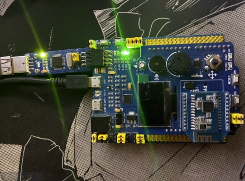

[source, cpp]

----

#include <iostream> // for std:: cout
#include "rccregisters.hpp" // for RCC
#include "gpioaregisters.hpp" // for GPIOA
#include "gpiocregisters.hpp" // for GPIOÑ

std::uint32_t SystemCoreClock = 16'000'000U;

extern "C" {
int __low_level_init(void)
{
  //Switch on external 16 MHz oscillator
  RCC::CR::HSION::On::Set();
  while (RCC::CR::HSIRDY::NotReady::IsSet())
  {

  }
  //Switch system clock on external oscillator
  RCC::CFGR::SW::Hsi::Set();
  while (!RCC::CFGR::SWS::Hsi::IsSet())
  {

  }

  RCC::APB2ENR::SYSCFGEN::Enable::Set();

  return 1;
}
}

void delay(int cycles)
{
  for(int i = 0; i < cycles; ++i)
  {
    asm volatile("");
  }
}

int main()
{

  //0x4002 0810
  RCC::AHB1ENR::GPIOAEN::Enable::Set() ;
  RCC::AHB1ENR::GPIOCEN::Enable::Set() ;
  GPIOA::MODER::MODER5::Output::Set() ;
  GPIOC::MODER::MODER5::Output::Set() ;
  GPIOC::MODER::MODER8::Output::Set() ;
  GPIOC::MODER::MODER9::Output::Set() ;
  bool flag = false;
  for(;;)
  {

   std::uint32_t* const gpiocOdrPtr = reinterpret_cast<std::uint32_t*>(0x40020814);
   std::uint32_t* const gpiocIdrPtr = reinterpret_cast<std::uint32_t*>(0x40020810);
   auto volatile idrValue= *gpiocIdrPtr;
   bool isButtonPressed = ((idrValue & (1<<13))==0);
   if (isButtonPressed)
   {
     *gpiocOdrPtr^= (1<<5);
     *gpiocIdrPtr^= (1<<5);
   }

     delay(1000000);

   }

  return 1;
}

----

== Пример выполнения

Рисунок 1. Пример