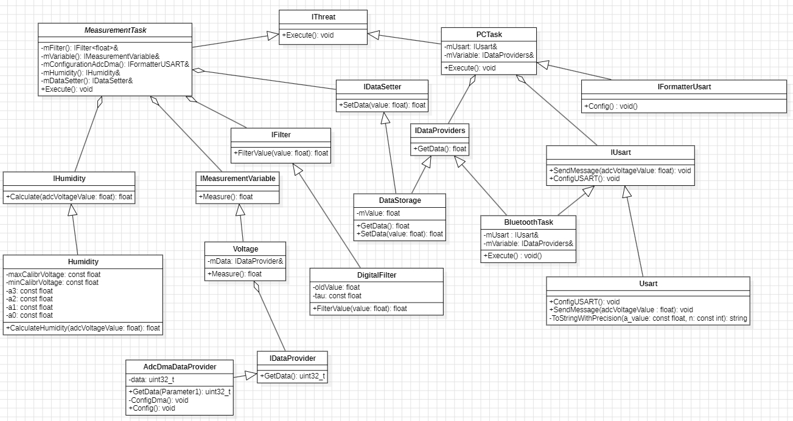

:toc: macro
:toc-title: Оглавление
:figure-caption: Рисунок
:coderay-css: style
:icons: font
:sectnums: 
:stem:
:eqnums: all

== Программирование 

Для удобства в создании кода была сделана UML-диаграмма для нашей программы.

.UML-диаграмма 

=== Структура программы

Архитектура программного обеспечения построена на принципах объектно-ориентированного проектирования с использованием интерфейсов для обеспечения гибкости и модульности. Ниже приведено описание основных классов и их взаимодействия.

==== Интерфейсы

[cols="1,3", options="header"]
|===
| Интерфейс | Описание
| `IThread` | Базовый интерфейс для всех задач реального времени (в коде реализован как шаблонный класс `OsWrapper::Thread<512U>`). Содержит абстрактный метод `Execute()`, который переопределяется в классах-наследниках для реализации основного цикла задачи.

| `IDataProviders` | Интерфейс для чтения данных. Предоставляет метод `GetData() const: float`, позволяющий получить сохранённое значение влажности.

| `IDataSetter` | Интерфейс для записи данных. Предоставляет метод `SetData(value: float): float`, позволяющий записать значение в хранилище.

| `IFilter` | Интерфейс цифрового фильтра (шаблонный). Содержит метод `FilterValue(value: T): T`, который принимает входное значение и возвращает отфильтрованное.

| `IDataProvider` | Интерфейс поставщика сырых данных с АЦП. Предоставляет метод `GetData(): uint32_t` для получения кода АЦП (0..4095).

| `IMeasurementVariable` | Интерфейс измерения физической величины. Содержит метод `Measure(): float`, преобразующий сырые данные в напряжение.

| `IFormatterUSART` | Интерфейс настройки периферии. Содержит метод `Config(): void` (в коде используется для настройки ADC+DMA, несмотря на название).

| `IUsart` | Интерфейс последовательного интерфейса. Предоставляет методы `ConfigUSART(): void` (настройка USART2) и `SendMessage(adcVoltageValue: float): void` (отправка данных).

| `IHumidity` | Интерфейс расчёта влажности. Предоставляет метод `CalculateHumidity(adcVoltageValue: float): float`, который по напряжению вычисляет влажность в процентах.
|===

==== Классы, реализующие интерфейсы

[cols="1,3", options="header"]
|===
| Класс | Описание
| `BluetoothTask` | Класс задачи для отправки данных по Bluetooth. Наследуется от `OsWrapper::Thread<512U>` и переопределяет метод `Execute()`. В цикле с периодом 1000 мс читает влажность из `DataStorage` и отправляет через USART на Bluetooth-модуль.

| `PCTask` | Класс задачи для отправки данных на ПК. Наследуется от `OsWrapper::Thread<512U>` и переопределяет метод `Execute()`. В цикле с периодом 1000 мс читает влажность из `DataStorage` и отправляет через USART на COM-порт.

| `MeasurementTask` | Класс задачи измерения. Наследуется от `OsWrapper::Thread<512U>` и переопределяет метод `Execute()`. Реализует цикл измерения влажности с периодом 100 мс, управляет взаимодействием между компонентами: получает данные от АЦП через `Voltage`, фильтрует через `DigitalFilter`, рассчитывает влажность через `Humidity`, сохраняет в `DataStorage`.

| `DataStorage` | Класс хранилища данных. Реализует интерфейсы `IDataProviders` и `IDataSetter`. Хранит текущее значение влажности в переменной `mValue`. Метод `GetData() const` возвращает сохранённое значение, `SetData()` — записывает новое.

| `DigitalFilter` | Шаблонный класс цифрового фильтра нижних частот первого порядка. Реализует интерфейс `IFilter`. Параметры шаблона: `dt` (период дискретизации), `rc` (постоянная времени). Содержит переменную `oldValue` (предыдущее отфильтрованное значение) и константу `tau = 1 - exp(-dt/rc)`.

| `Usart` | Класс для работы с последовательным интерфейсом. Реализует интерфейс `IUsart`. Метод `ConfigUSART()` настраивает USART2 на скорость 9600 бод, 8 бит данных, 1 стоп-бит. Метод `SendMessage(adcVoltageValue: float)` форматирует строку вида `"Humidity: X.XX %\r\n"` и отправляет. Метод `ToStringWithPrecision(a_value: const float, n: const int = 2): string` преобразует число с плавающей точкой в строку с заданным количеством знаков после запятой.

| `Humidity` | Класс расчёта влажности. Реализует интерфейс `IHumidity`. Содержит коэффициенты полинома третьей степени: +
`a3 = -2.213f`, `a2 = 5.353f`, `a1 = 49.275f`, `a0 = 0.011f`. +
Метод `CalculateHumidity(adcVoltageValue: float): float` принимает напряжение с датчика (0..3.3 В) и вычисляет влажность, обрезая результат до 100%.

| `AdcDmaDataProvider` | Класс поставщика данных с АЦП через DMA. Реализует интерфейсы `IDataProvider` (возвращает `uint32_t`) и `IFormatterUSART` (метод `Config()`). Содержит приватное поле `data` для хранения кода АЦП. Метод `GetData(): uint32_t` возвращает текущее значение АЦП (0..4095). Метод `Config()` настраивает ADC1 в непрерывном режиме и DMA2 для автоматической передачи данных из АЦП в память без участия процессора.

| `Voltage` | Шаблонный класс преобразования кода АЦП в напряжение. Реализует интерфейс `IMeasurementVariable`. Параметры шаблона: `gain` и `offset`. Содержит ссылку `mData` на `IDataProvider`. Метод `Measure(): float` вычисляет напряжение по формуле: `gain * (float)rawData + offset`.
|===

== Экспериментальная часть

Мы провели калибровку и получили следующие значения сырого кода АЦП:

* 1412 для 60%;
* 933 для 40%;
* 467 для 20%;
* 2 для 0%.

Далее будут показаны видео, как происходили все эксперементы по отпределению корректности работы датчика влажности.

В первом видио показано, как мы высушивали землю.

video::1.mp4[]

Далее мы измерили влажность в полностью сухой почве, где предполагалась влажность 0%

video::2.mp4[]

Следующий шаг заключается в том, что мы добавляем 20 г воды в землю, чтобы добиться результата 20% влажности почвы. Вы можете увидеть это на следующих двух видео.

video::3.mp4[]

video::4.mp4[]

Далее добиваемся того, чтобы почва имела влажность 40% и проверяем это.

video::5.mp4[]

И также делаем для 60% и проверяем это.

video::6.mp4[]