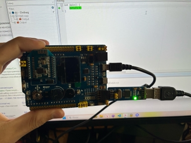

= Лабораторная работа 2
:toc: macro
:toc-title: Оглавление

include::Titulnik.adoc[]

toc::[]

== Введение

На этой лекции мы начали погружаться в мир встраиваемых систем. Я узнал, что это такое, с какими инструментами нам предстоит работать, и как вообще выглядит процесс создания программы для микроконтроллера.

== Основные понятия 

Сначала мы разобрались с базовыми терминами:

Встраиваемая система (Embedded System) — это маленький специализированный компьютер, который встроен прямо в устройство, которым он управляет (например, в стиральную машину или пульт от телевизора).

Микроконтроллер (MCU) — это "мозг" системы. Это такая микросхема, на которой есть и процессор, и память, и средства для подключения к другим устройствам. По сути, это простой однокристальный компьютер.

Плата разработки (Oпладочная плата) — это плата с микроконтроллером и минимально необходимыми компонентами, чтобы мы могли легко писать и тестировать программы.

Интегрированная среда разработки (IDE) — это главный наш инструмент. Такая программа, в которой есть всё необходимое для программирования: текстовый редактор, компилятор и отладчик. Мы будем использовать IAR Embedded Workbench for ARM.

== Что происходит внутри микроконтроллера при включении

Это была очень важная часть! Когда мы подаем питание, микроконтроллер не сразу начинает выполнять нашу функцию main().
Сначала происходит последовательная подготовка:

Инициализация стека (Stack): Стек — это особая область памяти для временных данных. Микроконтроллер настраивает указатель на его начало.

Инициализация переменных: Все глобальные переменные, которые мы не успели инициализировать, обнуляются. Затем те переменные, которым мы задали начальное значение (например, int i = 5;), инициализируются этими значениями.

"В типичном сценарии разработки на C++ управление передается вашей функции main() не напрямую от операционной системы. Предварительно выполняется startup-код, который компилятор и линкер добавляют автоматически. Этот код отвечает за:

1.Инициализацию глобальных и статических переменных

2.Подготовку аргументов argc и argv

3.Настройку механизмов обработки исключений

4.Инициализацию стандартной библиотеки C++

Без этого кода стандартные программы C++ не смогут корректно работать, так как многие языковые конструкции зависят от этой предварительной настройки среды выполнения."

===  Как программа становится понятной для микроконтроллера

Оказалось, что наш код на C++ не может сразу выполниться на микроконтроллере. Он проходит два важных этапа:

Компиляция (трансляция): Компилятор переводит наш понятный человеку код в машинный код (объектные файлы).

Компоновка (линковка): Линковщик берет все объектные файлы и библиотеки, склеивает их в одну готовую программу (исполняемый файл), которую уже можно "прошивать" в микроконтроллер.

== Почему мы используем C++

Мы обсудили, что C++ — это не страшный монстр для больших компьютеров. Для микроконтроллеров он подходит отлично, потому что:

Это строго типизированный язык, что помогает избежать многих ошибок.

Он поддерживает ООП (объектно-ориентированное программирование), что позволяет писать более понятный и структурированный код, особенно для сложных устройств.

Современные компиляторы (вроде того, что в IAR) генерируют компактный и эффективный код, не уступающий коду на Си.

=== Память, стек и куча

Мы поговорили об архитектуре памяти микроконтроллеров ARM (модифицированная Гарвардская) и о том, как линковщик распределяет код и данные по областям памяти (ПЗУ и ОЗУ).

Стек (Stack) — используется для хранения локальных переменных, адресов возврата из функций и т.д. Его размер нужно задавать вручную с запасом. IAR умеет анализировать код и подсказывать максимально возможное использование стека.

Куча (Heap) — используется для динамического выделения памяти (оператор new). Важный вывод: в надежных встраиваемых системах динамическую память стараются не использовать, чтобы избежать фрагментации и непредсказуемого поведения. Лучше создавать объекты статически.

=== Подключение платы к компьютеру 

[.text-center]
Рисунок 1. Результаты подключения

=== Пример компиляции проекта
[.text-center]
image:Figure2.jpg[]
Рисунок 2. Пример компиляции

== Вывод

В этой работе я разобрался, как программировать микроконтроллеры — «мозги» встроенной электроники. Узнал, что после включения микроконтроллер сначала готовит память и только потом запускает нашу программу. На практике создал проект в IAR и понял, что C++ отлично подходит для таких задач, так как помогает писать структурированный и надежный код. Главный вывод: в системах лучше избегать динамической памяти, чтобы обеспечить стабильную работу устройства.