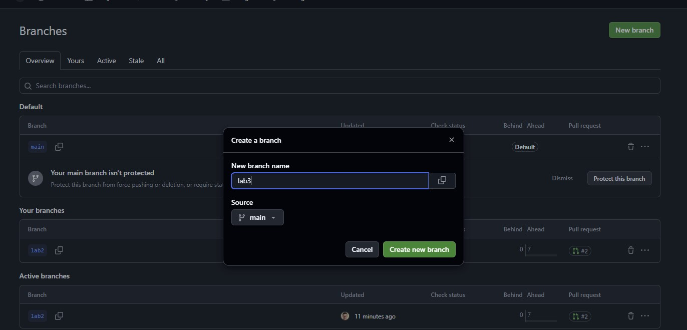
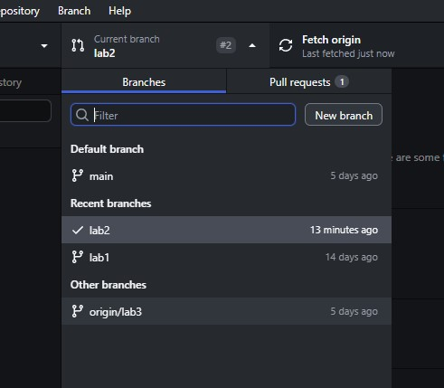
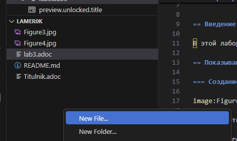
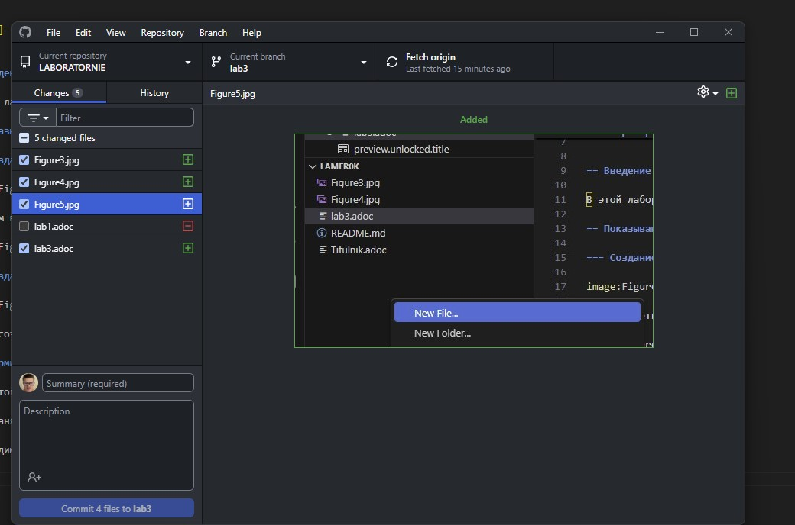
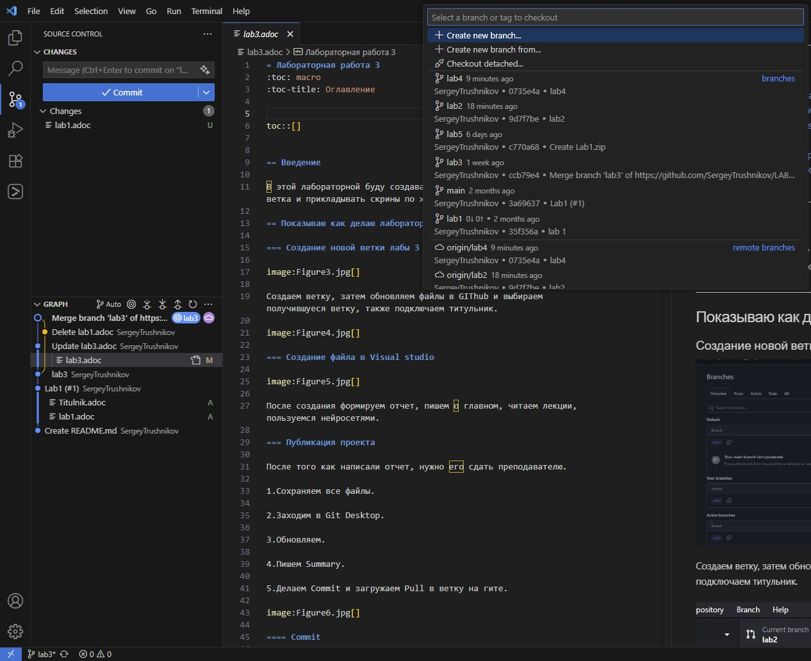
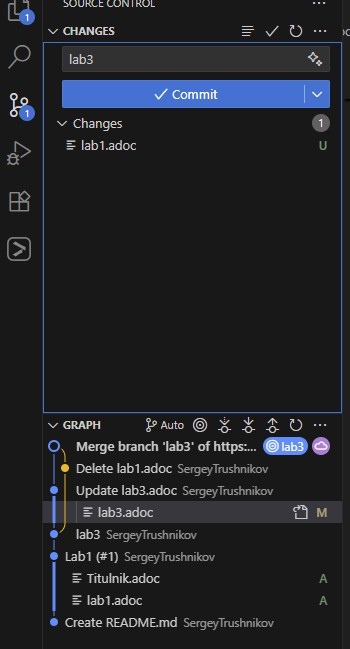
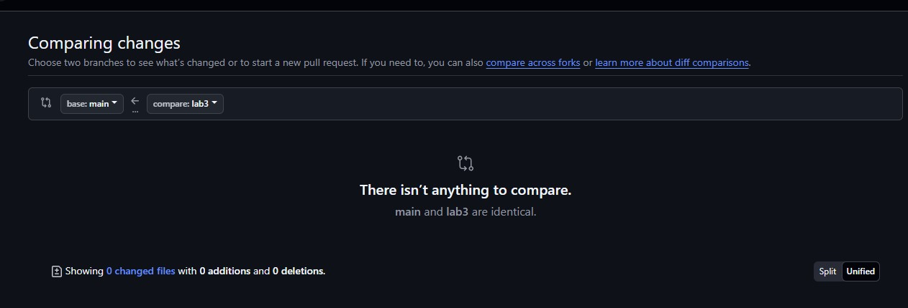
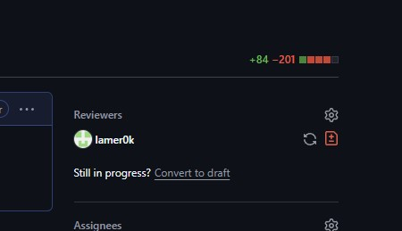
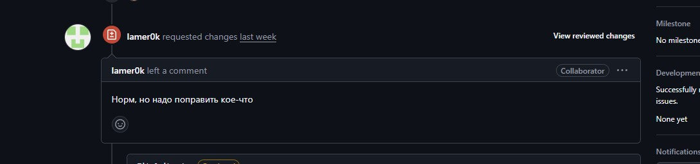

= Лабораторная работа 3
:toc: macro
:toc-title: Оглавление

include::Titulnik.adoc[]

toc::[]

== Введение

В этой лабораторной буду создавать и показывать, как делается новая ветка и прикладывать скрины по ходу пьесы.

== Показываю как делаю лабораторные

=== Создание новой ветки лабы 3

Создаем ветку, затем обновляем файлы в GIThub и выбираем получившуеся ветку, также подключаем титульник.

=== Создание файла в Visual studio

После создания формируем отчет, пишем о главном, читаем лекции, пользуемся нейросетями. 

=== Публикация проекта

После того как написали отчет, нужно его сдать преподавателю.

1.Сохраняем все файлы.

2.Заходим в Git Desktop.

3.Обновляем.

4.Пишем Summary. 

5.Делаем Commit и загружаем Pull в ветку на гите.

=== Показываю как сделать в самом VS

1.Создаем или выбираем уже созданную ветку.

2.Делаем свой отчет, или же добавляем изменения и сливаем его прям в VS.

3.
==== Commit

Коммит- это сохранение изменений с описанием того, что было исправлено 

В GitHub Desktop выбираю файлы для выгрузки файлов во вкладке "Changes"

Отмечаю галочками файлы для коммита

Нажимаю "Commit to [LAB3]"

==== Fetch (Получение)

Он только загружает информацию об изменениях с удаленного репозитория (например, новые коммиты, ветки), но не объединяет их с файлами. Это позволяет увидеть, что произошло на сервере, без немедленного изменения кода.

==== Pull request

Команда pull пытается автоматически объединить изменения с текущей локальной веткой. Для ее создания нужно:

Перехожу на страницу репозитория на GitHub

Нажимаю на вкладку "Pull Requests"

Кнопка "New Pull Request"

Выбираю ветки для сравнения, чтобы запустить новый запрос на извлечение, на данном этапе коммит должен быть выполнен.

Нажмите "Create Pull Request"

==== Push

Команда push отправляет локальные коммиты на удаленный репозиторий. Это этап, когда  работа становится доступной для других участников проекта.

==== Merge (Слияние)

Merge — это команда для объединения изменений из одной ветки в другую. Это ключевая операция, которая позволяет интегрировать выполненную работу (например, из LAB3) в основную ветку (main).

=== Как исправлять и закрывать комментарии к PR

Если ошибки не критичные, то исправляю их сам и сливаю(merge) файлы в основную ветку, после чего можно удалить побочную ветку.
Если же ошибки значительные, смотрю на указанные проблемы в ходе создания отчета и исправляю их. Делаю коммит, после чего исправленные файлы автоматически заменяют старые. 

=== Подтверждение преподавателем

1.После Pull с гита с компа, заходим на сайт и делаем Pull request. (Так как я не сделал отчет по лабе 3, буду показывать на примере лабы 2)

2.Создаем и смотрим правильность перемещения, нужно из lab3 в main.

3.Обязательно добавляем смотрящего.

4.Это все дело дошло до преподавателя, ждем пока проверит и найдет ошибки.

5.Если преподавателю все понравилось и он сделал Approved, значит можно сгружать в основную ветку main.

== Вывод

В данном отчете был разобран путь, от создания ветки до проверки отчета преподавателем и слив его в главную ветку. (Вроде ничего не забыл)