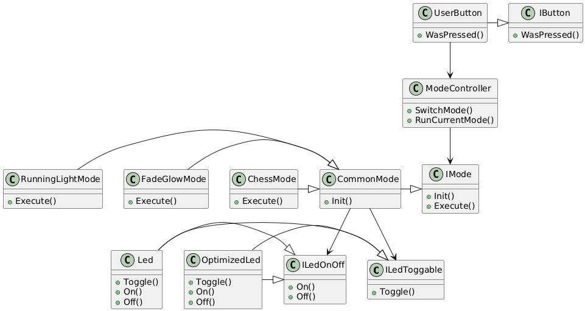
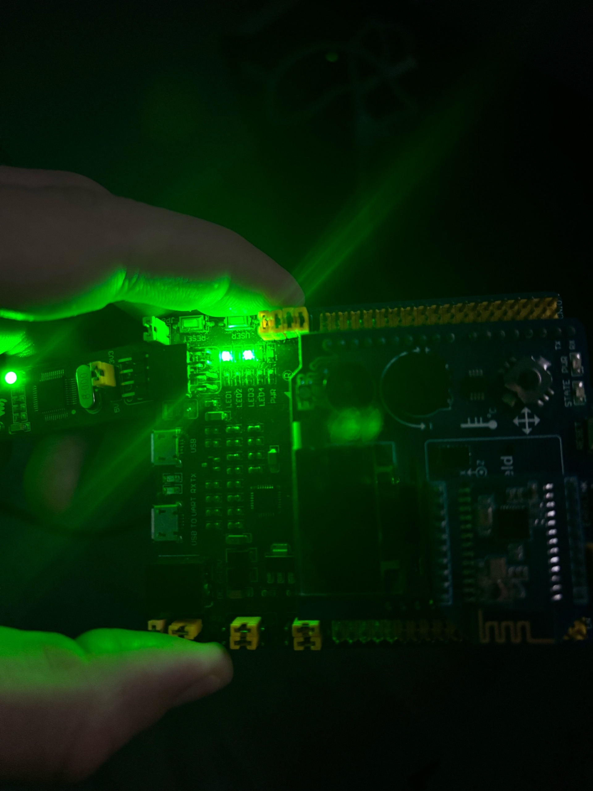

// В самое начало файла
:plantuml-server-url: https://www.plantuml.com/plantuml
:allow-uri-read:

= Лабораторная работа №5

:toc: macro
:toc-title: Оглавление

include::Titulnik.adoc[]

toc::[]

== Цель работы и задания

Задания:

ПО для управления светодиодами

1.  ПО для управления светодиодами
   •  по нажатию кнопки — менять режим работы;
   •  реализовать три режима:
       o  «Моргание» — все светодиоды загораются и гаснут синхронно. 
       o  «Бегущий огонёк» — светодиоды зажигаются поочерёдно.
      o  «Шахматка» — чётные и нечётные светодиоды работают в противофазе: одни горят, другие гаснут. Интеллектуальный режим для избранных.

2.  Организация кода
Каждый класс — в отдельных файлах:
   •  .h — заголовочный файл (тут описываем, что класс умеет);
   •  .cpp — файл реализации (тут пишем, как он это делает).
Цель: чтобы код был чистым, как в учебнике, и не напоминал спагетти.

3.  UML диаграммы
 Надо нарисовать схемы, которые покажут, как всё это работает. Не для красоты, а чтобы:
   •  преподаватель увидел, что мы не просто «нажали кнопки», а продумали архитектуру;
   •  мы сами через месяц вспомнили, что тут вообще происходит.
Подойдут диаграммы классов, последовательностей или что то ещё, что поможет объяснить, почему светодиоды моргают именно так, а не иначе.

4.  Отчёт
Нужно написать документ, где будет:
   •  описание того, как работает ПО (без воды, но с деталями);
   •  объяснение, почему выбраны именно такие интерфейсы (а не какие то другие);
   •  рассказ, как определялись абстракции (да, это было непросто);
   •  история про то, как мы «изобретали» шаблон проектирования «Стратегия» (на самом деле не изобретали, но убедительно это подадим).
Главное — чтобы читалось не как «отписка», а как честный рассказ о том, что и почему мы сделали.

Цель работы:

1.Разработать модульную, расширяемую и поддерживаемую систему управления светодиодами с тремя режимами работы, применив принципы объектно-ориентированного программирования и шаблон проектирования «Стратегия». Освоить на практике:

2.Проектирование архитектуры — от монолитной структуры к модульной, следуя принципам SOLID

3.Создание чистых интерфейсов — минимальных, целевых, соответствующих принципу разделения интерфейсов

4.Организацию кода — разделение на заголовочные и исходные файлы для повышения читаемости и поддерживаемости

5.Документирование решений — создание UML-диаграмм и технического отчёта, объясняющего принятые архитектурные решения

== Принцип работы системы

Система — это контроллер для управления группой светодиодов, поддерживающий несколько режимов работы. Архитектура построена на объектно-ориентированном подходе, где у каждого компонента своя зона ответственности.

=== Основной рабочий цикл

[source,cpp]

----

while (true) {
if (button.WasPressed()) {
controller.SwitchMode();
}
controller.RunCurrentMode();
Delay(300);
}

----

Реализованы три режима:

RunningLightMode — светодиоды переключаются последовательно («бегущий огонь»)

FadeGlowMode — все светодиоды управляются синхронно

ChessMode — светодиоды включаются попеременно, как в шахматном порядке

Каждый режим содержит собственную логику и взаимодействует со светодиодами только через абстрактные интерфейсы.

== Обоснование выбора интерфейсов

=== Простой дизайн IButton

Интерфейс IButton был сделан минимальным и содержал только необходимый функционал:

[source,cpp]

----

class IButton {
public:
virtual bool WasPressed() const = 0;
};

----

Рассматривались и более сложные варианты — с обработкой отпускания кнопки, долгого нажатия и других событий. Но анализ показал, что системе достаточно знать только о самом факте нажатия. Такой подход даёт несколько преимуществ:

Упрощает реализацию для разных платформ

Облегчает тестирование с использованием mock-объектов

Уменьшает связность компонентов

=== Разделение интерфейсов для светодиодов

Сначала мы думали над единым интерфейсом, который объединит все возможные операции со светодиодами. Но в процессе стало ясно, что лучше разделить их:

[source,cpp]

----

class ILedToggable {
public:
virtual void Toggle() const = 0;
};

class ILedOnOff {
public:
virtual void On() const = 0;
virtual void Off() const = 0;
};

----
Причины разделения:

Сначала у нас был только один сценарий использования — нужно было просто переключать светодиоды. Мы создали интерфейс ILedToggable с одним методом Toggle(), который переключал состояние светодиода на противоположное. Этого было достаточно для первого режима работы.

Потом появилась новая задача — нужно было включать и выключать светодиоды точно, а не просто переключать. Оказалось, что Toggle() не подходит, потому что мы не можем гарантировать, в какое состояние перейдет светодиод — он зависит от предыдущего состояния.

Так мы поняли, что наш первоначальный интерфейс ILedToggable слишком узкий для новых требований. Вместо того чтобы расширять его методами On() и Off() (что нарушило бы принцип разделения интерфейсов), мы создали новый интерфейс ILedOnOff с двумя отдельными методами для точного управления.

Так интерфейсы естественным образом разделились по принципу «один интерфейс — одна ответственность».

== Процесс определения абстракций

Архитектура создавалась итеративно: мы постепенно выделяли абстракции из изначально монолитного кода.

=== Первый вариант

Изначально всё было в одном модуле:

Управление светодиодами

Обработка нажатий кнопки

Логика всех режимов

Такой подход быстро показал свою негибкость при попытках что-то добавить или изменить.

=== Выделение ключевых абстракций

В процессе рефакторинга мы выделили следующие сущности:

Управление светодиодами — отделили от логики режимов

Обработка ввода — вынесли в отдельный компонент

Реализация режимов — унифицировали через общий интерфейс

=== Базовый класс CommonMode

Мы заметили, что в разных режимах повторяется один и тот же код, и создали базовый класс CommonMode, куда вынесли:

Ссылки на светодиоды

Текущий индекс активного светодиода

Стандартную реализацию Init()

Это помогло убрать дублирование и упростить добавление новых режимов.

== Эволюция архитектуры и паттерн Стратегия

В процессе разработки архитектура естественным образом пришла к паттерну «Стратегия», хотя изначально мы его не планировали.

=== Изначальное управление режимами

Сначала режимы переключались через switch-case:

[source,cpp]

----

void RunCurrentMode() {
switch(mCurrentMode) {
case 0:
// Режим 1
break;
case 1:
// Режим 2
break;
case 2:
// Режим 3
break;
}
}

----

Это было неудобно и мешало развитию системы.

=== Проблемы начального подхода

Мы выделили несколько ключевых недостатков:

Нарушение OCP — чтобы добавить режим, приходилось менять существующий код

Сложно тестировать — нельзя проверить один режим в изоляции

Сильная связанность — управление режимами было завязано на их реализацию

Что не так с тестированием?

1.Нельзя проверить один режим отдельно
Чтобы протестировать "режим А", приходится запускать и настраивать ВСЕ режимы разом.

2.Тесты хрупкие как стекло
Изменил что-то в "режиме Б" → сломались тесты "режима А". Хотя их логика не связана!

3.Добавил новый режим → перепроверяй все старые
Каждое добавление заставляет перезапускать ВСЕ тесты, а не только те, что касаются нового кода.

4.Тесты долгие и сложные
Вместо маленьких быстрых тестов получаем монстра, который проверяет всё сразу и падает непонятно где.

Почему так происходит?

Представьте кухонный комбайн:
У вас одна кнопка с кучей режимов ("резать", "месить", "взбивать"). Чтобы проверить, хорошо ли он режет, вам нужно:

1.Включить весь комбайн

2.Выбрать режим "резать"

3.Но при этом в фоне крутятся ножи для других режимов

4.И если сломается "взбивать", перестанет работать и "резать"

В идеале должно быть:

Каждый нож (режим) тестируется отдельно. Сломался один нож — остальные работают. Добавил новый нож — старые тесты не трогаешь.

Как исправить?

Сделать каждый режим отдельным модулем, который:

1.Тестируется изолированно

2.Ломается только сам, а не ломает другие

3.Добавляется без правки старых тестов

Короче: плохая архитектура заставляет тестировать слона целиком, когда нужно проверить только хобот.

=== Переход к абстракциям

Мы поняли, что каждый режим — это по сути свой алгоритм управления светодиодами, и ввели общий интерфейс:

[source,cpp]

----

class IMode {
public:
virtual void Init() = 0;
virtual void Execute() = 0;
};

----

Контроллер режимов стал работать с абстракциями:

[source,cpp]

----

void ModeController::RunCurrentMode() {
mModes[mCurrentMode]->Execute();
}

----

=== Преимущества новой архитектуры

Паттерн Стратегия дал нам следующие плюсы:

Расширяемость — новый режим можно добавить просто создав новый класс

Тестируемость — каждый режим тестируется отдельно

Удобство поддержки — логика режима изолирована в своём классе

Чистота архитектуры — контроллер не знает о деталях реализации режимов

=== Диаграмма классов системы

На UML-диаграмме показана архитектура системы управления светодиодами. Можно увидеть:

Интерфейсы и реализации: IButton, IMode, ILedToggable, ILedOnOff и их конкретные реализации

Наследование и композиция: CommonMode — базовый класс для всех режимов, от него наследуются конкретные режимы

Связи между компонентами: ModeController использует интерфейс IMode, что обеспечивает слабую связанность

Разделение интерфейсов: Led и OptimizedLed реализуют оба интерфейса управления, что позволяет гибко их использовать

Диаграмма отражает применение принципов SOLID, особенно разделения интерфейсов и открытости/закрытости.

Рисунок 1. UML - диаграмма

[mermaid]
----
%%{init: {'theme': 'default', 'themeVariables': {
  'fontSize': '16px',
  'primaryBorderColor': '#000',
  'lineColor': '#000',
  'edgeLabelBackground': '#fff'
}}}%%

classDiagram
    direction TB
    
    %% Интерфейсы
    class IButton {
        <<interface>>
        +Press()
        +Release(IButton)
    }
    
    class ILedToggable {
        <<interface>>
        +Toggle()
    }
    
    class ILedOnOff {
        <<interface>>
        +On()
        +Off()
    }
    
    class IMode {
        <<interface>>
        +Execute()
    }
    
    %% Основные классы
    class Bluetooth {
        <<Android>>
        Bluetooth(Android)
        a.huromicrosofibus(c)
    }
    
    class MacKController {
        -mModes : IMode[]
        -mCurrentMode : uint32_t
        +MacKController(modes: const IMode[])
        +RunCurrentMode()
    }
    
    class UniButton {
        -pinNumber : uint32_t
        -registerAddress : uint32_t
        +UniButton(pinNum: uint32_t, registerAddress: uint32_t)
        +WasPressed() bool
    }
    
    class CommonMode {
        <<abstract>>
        -mLeds : const ILedToggable[]
        -mLedsOnOff : const ILedOnOff[]
        -mCurrentIndex : uint32_t
        +CommonMode(leds: const ILedToggable[], ledsOnOff: const ILedOnOff[])
        +Execute()
    }
    
    class RunningLightMode {
        +RunningLightMode(leds: const ILedToggable[], ledsOnOff: const ILedOnOff[])
        +Execute()
    }
    
    class FadeGlowMode {
        +FadeGlowMode(leds: const ILedToggable[], ledsOnOff: const ILedOnOff[])
        +Execute()
    }
    
    class ChessMode {
        -phase : bool = false
        +ChessMode(leds: const ILedToggable[], ledsOnOff: const ILedOnOff[])
        +Execute()
    }
    
    class Led {
        -pinNumber : uint32_t
        -registerAddress : uint32_t*
        +Led(pinNum: uint32_t, registerAddress: uint32_t)
        +Toggle()
        +On()
        +Off()
    }
    
    class OptimizedLed {
        -registerAddress : uint32_t const
        -pinNumber : uint32_t
        +OptimizedLed(registerAddress: uint32_t const, pinNumber: uint32_t)
        +Toggle()
        +On()
        +Off()
    }
    
    %% Наследование
    IButton <|-- UniButton
    IButton <|-- Bluetooth
    IMode <|-- CommonMode
    CommonMode <|-- RunningLightMode
    CommonMode <|-- FadeGlowMode
    CommonMode <|-- ChessMode
    ILedToggable <|.. Led
    ILedOnOff <|.. Led
    ILedToggable <|.. OptimizedLed
    ILedOnOff <|.. OptimizedLed
    
    %% Композиция и агрегация
    MacKController "1" *-- "*" IMode : содержит
    CommonMode "1" *-- "*" ILedToggable : управляет светодиодами
    CommonMode "1" *-- "*" ILedOnOff : управляет включением/выключением
    
    %% Зависимости
    MacKController ..> UniButton : использует
    MacKController ..> Bluetooth : использует
    
    %% Стилизация
    style IButton fill:#f0f8ff,stroke:#1e90ff
    style IMode fill:#f0f8ff,stroke:#1e90ff
    style ILedToggable fill:#f0f8ff,stroke:#1e90ff
    style ILedOnOff fill:#f0f8ff,stroke:#1e90ff
    style Bluetooth fill:#e6f7ff,stroke:#1890ff
    style MacKController fill:#f6ffed,stroke:#52c41a
    style UniButton fill:#fff7e6,stroke:#fa8c16
    style CommonMode fill:#fff0f6,stroke:#eb2f96
    style RunningLightMode fill:#f9f0ff,stroke:#722ed1
    style FadeGlowMode fill:#f9f0ff,stroke:#722ed1
    style ChessMode fill:#f9f0ff,stroke:#722ed1
    style Led fill:#fcffe6,stroke:#7cb305
    style OptimizedLed fill:#e6fffb,stroke:#13c2c2
----
Рисунок 2. UML - диаграмма

== Заключение

Разработанная архитектура — пример успешного применения ООП-принципов во встраиваемых системах. Среди ключевых результатов:

Чёткое разделение зон ответственности

Минималистичные интерфейсы, ориентированные на реальные задачи

Гибкость и простота расширения

Естественное применение паттернов проектирования через решение практических проблем

Наш опыт подтверждает: тщательный анализ и постепенный рефакторинг позволяют создать чистую и удобную для поддержки архитектуру даже в условиях встраиваемых систем.

=== Пример работы программы

Рисунок 3. Пример работы

=== Полный код программы

[source,cpp]

----

#include "iostream"//for std::cout
#include "rccregisters.hpp" // for RCC
#include "gpioaregisters.hpp" // for GPIOA
#include "gpiocregisters.hpp" // for GPIOÑ
#include <array>// for std::array
#include "Led.h" // for Led, ILedToggable, ILedOnOff
#include "OptimizedLed.h" // for OptimizedLed
#include "CommonMode.h"
#include "RunningLightMode.h"
#include "FadeGlowMode.h"
#include "ChessMode.h"
#include "UserButton.h"
#include "ModeController.h"
std::uint32_t SystemCoreClock = 16'000'000U;
extern "C" {
int __low_level_init(void)
{
  //Switch on external 16 MHz oscillator
  RCC::CR::HSION::On::Set();
  while (RCC::CR::HSIRDY::NotReady::IsSet())
  {
  }
  //Switch system clock on external oscillator
  RCC::CFGR::SW::Hsi::Set();
  while (!RCC::CFGR::SWS::Hsi::IsSet())
  {
  }
  RCC::APB2ENR::SYSCFGEN::Enable::Set();
  return 1;
}
}
void delay(int cycles)
{
  for(int i = 0; i < cycles; ++i)    
  {
    asm volatile("");
  }    
}
constexpr std::uint32_t buttonPinNum = 13;
constexpr std::uint32_t portCIdrAddress = 0x40020810U;
UserButton userButton(buttonPinNum, portCIdrAddress);
Led led1(5, 0x40020814U);
Led led2(8, 0x40020814U);
Led led3(9, 0x40020814U);
//Led led4(5, 0x40020014U);
OptimizedLed<0x40020014U, 5> led4;
tLeds leds = 
{
  &led1,
  &led2,
  &led3,
  &led4
};
tLedsOnOff ledsOnOff = 
{
  &led1,
  &led2,
  &led3,
  &led4
};
RunningLightMode runningLightMode(leds, ledsOnOff);
FadeGlowMode fadeGlowMode(leds, ledsOnOff);
ChessMode chessMode(leds, ledsOnOff);
tModes modes
{
  &runningLightMode,
  &fadeGlowMode,
  &chessMode
};
ModeController modeController(modes);
int main()
{ 
  
  RCC::AHB1ENR::GPIOAEN::Enable::Set() ;
  RCC::AHB1ENR::GPIOCEN::Enable::Set() ;
  GPIOA::MODER::MODER5::Output::Set() ;
  GPIOC::MODER::MODER5::Output::Set() ;
  GPIOC::MODER::MODER8::Output::Set() ;
  GPIOC::MODER::MODER9::Output::Set() ;
  for(;;)
  {   
    if (userButton.WasPressed())
    {
      modeController.SwitchMode(); 
    }
    delay(500000);
    modeController.RunCurrentMode(); 
     //GPIOA::ODR::ODR5::High::Set();
     //GPIOC::ODR::ODR5::High::Set();
     //GPIOA::ODR::ODR5::Low::Set();
     //GPIOC::ODR::ODR5::Low::Set();
  }
  return 1;
}

----