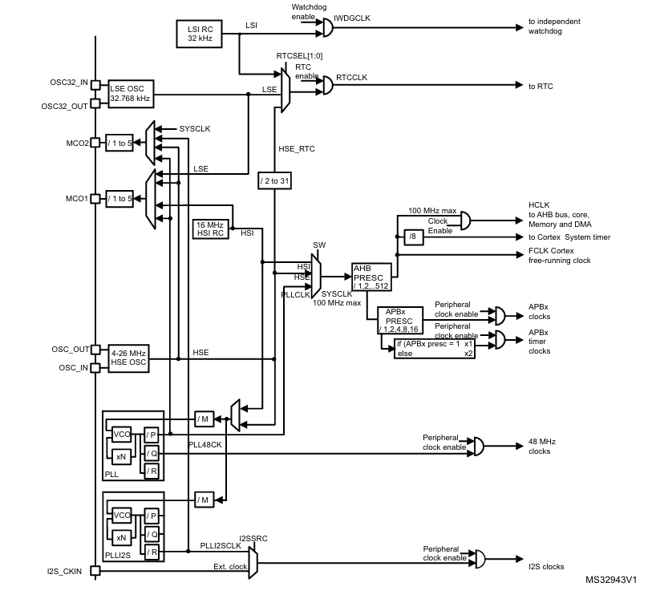
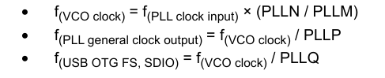
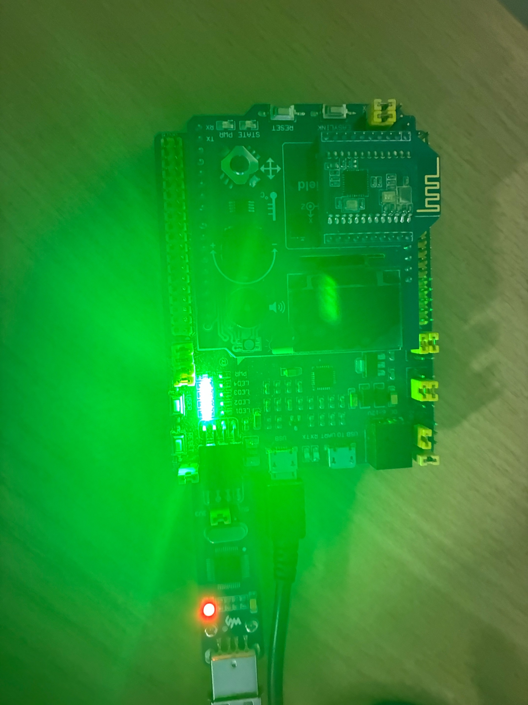

= Лабораторная работа 6
:toc: macro
:toc-title: Оглавление
:figure-caption: Рисунок

include::Titulnik.adoc[]

toc::[]

== Введение

Цель работы — сделать лабораторную работу
Задание на следующую субботу:

1. Разобраться почему кнопка не работает
2. Заменить работу через системный таймер, на работу через TIM2 (сделать его настройку, запустить, проверять флаг переполнения)
3. Оформить лабу (с описанием системы тактирования, настройки на внеший, внутренний источник тактирования, PLL, добавить про порты, настройка, как работают зачем нужны, добавить про таймера - системный, TIM2) все описать своимо словами, с примерами кода, картинками и аккуратно оформить.

- переключение на внешний высокочастотный генератор(HSE) с помощью PLL;
- написать о системе тактирования микроконтроллера;
- настройка портов ввода/вывода;
- работа с системным таймером (SysTick) и таймерами общего назначения (TIM2);

== 1. Система тактирования STM32F411

=== 1.1 Доступные источники тактового сигнала

Микроконтроллер STM32F411 поддерживает несколько источников тактовой частоты:

* *HSI (High Speed Internal)* — внутренний RC-генератор 16 МГц
* *HSE (High Speed External)* — внешний кварцевый резонатор 8 МГц
* *PLL (Phase Locked Loop)* — система фазовой автоподстройки частоты
* *LSI/LSE* — низкочастотные генераторы для RTC и сторожевых таймеров

.Структура системы тактирования STM32F411

=== 1.2 Переход на внешний генератор с использованием PLL

Поменял значение RCC_PLLCFGR_PLLM_Values в папке rccregisters.hpp, т.к. регистр PLLM в нем имел неверную информацию.

.Настройка регистра PLLM
[cols="a,a"]
|===
| image::код.png[]
| image::PLL configuration.png[]
|===

Затем с помощью регистров PLLM, PLLN, PLLP подобрали частоту. 
В нашем случае необходимо получить f = 32 МГц, для этого подберем PLLM, PLLN, PLLP такие, чтобы выполнялась формула:

[source]
----
f = f(PLL clock input) × (PLLN / PLLM) / PLLP
----

32 МГц = 8 × 64 / 2 / 8

.Ограничения при расчёте PLL
====
* PLLM ∈ [2, 63]
* PLLN ∈ [50, 432]
* PLLP ∈ {2, 4, 6, 8}
* PLLQ ∈ [2, 15] (для USB/SDIO/RNG)
* PLLR ∈ [2, 7] (для системных часов)
* Проверка: f_вход_PLL = f_кварца / PLLM должна быть ≈2 МГц
* Проверка: f_VCO = f_вход_PLL × PLLN должна быть 100–432 МГц
* Проверка: f_выход = f_VCO / PLLP ≤ максимальной частоте МК
====

.Фазовая подстройка частоты PLL

Четко, все регистры подобрал. Дальше выполню все необходимые шаги для переключения на HSE

Шаг 1: Включение внешнего кварца (HSE)

Шаг 2: Переключение на HSE как системную частоту

Шаг 3: Настройка PLL (Phase-Locked Loop)

Шаг 4: Запуск PLL и переключение на него

Шаг 5: Включение системного контроллера

[source,cpp]
----
extern "C"
{
int __low_level_init(void)
{
  RCC::CR::HSEON::On::Set();
  while (RCC::CR::HSERDY::NotReady::IsSet())
  {
  }
  RCC::CFGR::SW::Hse::Set();
  while (!RCC::CFGR::SWS::Hse::IsSet())
  {

  }  
  RCC::CR::HSION::Off::Set();
  RCC::PLLCFGR::PLLSRC::HseSource::Set(); 
  RCC::PLLCFGR::PLLM::Set(2U);     // M = 2 
  RCC::PLLCFGR::PLLN::Set(64U);    // N = 64 
  RCC::PLLCFGR::PLLP::Set(3U);     // P = 8 
  RCC::CR::PLLON::On::Set();
  while (RCC::CR::PLLRDY::Unclocked::IsSet())
  {
  }
  RCC::CFGR::SW::Pll::Set();
  while (!RCC::CFGR::SWS::Pll::IsSet())
  {
  }
  RCC::APB2ENR::SYSCFGEN::Enable::Set();
  return 1;
}
}
----

=== 1.3 Алгоритм настройки частоты

Алгоритм переключения на HSE включал следующие шаги:

. Включение внешнего кварца (HSE)
. Переключение на HSE как системную частоту
. Настройка параметров PLL
. Запуск PLL и переключение на него
. Включение системного контроллера

=== Различия в использовании PLL для 16 МГц и 32 МГц

==== **1. Код для 16 МГц (без PLL)**

[source,cpp]
----
std::uint32_t SystemCoreClock = 16'000'000U;

extern "C" {
int __low_level_init(void)
{
  RCC::CR::HSION::On::Set();
  while (RCC::CR::HSIRDY::NotReady::IsSet()) {
  }
  
  RCC::CFGR::SW::Hsi::Set();
  while (!RCC::CFGR::SWS::Hsi::IsSet()) {
  }
  
  RCC::APB2ENR::SYSCFGEN::Enable::Set();
  
  return 1;
}
}
----

**Почему нет PLL:**

* **HSI = 16 МГц** — внутренний RC-генератор уже выдает нужную частоту
* **Нет необходимости в умножении** — источник и требуемая частота совпадают
* **Простота и надежность** — меньше кода, быстрее запуск
* **Энергоэффективность** — PLL потребляет дополнительную мощность

==== **2. Код для 32 МГц (с PLL)**

[source,cpp]
----
std::uint32_t SystemCoreClock = 32'000'000U;

extern "C" {
int __low_level_init(void)
{
  RCC::CR::HSEON::On::Set();
  while (RCC::CR::HSERDY::NotReady::IsSet()) {
  }
  
  RCC::PLLCFGR::PLLM::Write(8);
  RCC::PLLCFGR::PLLN::Write(64);
  RCC::PLLCFGR::PLLP::Write(0);
  RCC::PLLCFGR::PLLSRC::Hse::Set();
  
  RCC::CR::PLLON::On::Set();
  while (RCC::CR::PLLRDY::NotReady::IsSet()) {
  }
  
  RCC::CFGR::SW::Pll::Set();
  while (!RCC::CFGR::SWS::Pll::IsSet()) {
  }
  
  RCC::APB2ENR::SYSCFGEN::Enable::Set();
  
  return 1;
}
}
----

**Почему нужен PLL:**

* **HSE = 8 МГц** — внешний кварц имеет фиксированную частоту
* **Требуется 32 МГц** — нужно увеличить частоту в 4 раза
* **PLL как умножитель частоты** — преобразует 8 МГц → 32 МГц
* **Расчет:** 32 МГц = (8 МГц / 8) × 64 / 2

Ниже приведено доказательство того что плата еще работает

.Плата

== 2. Работа с портами ввода/вывода (GPIO)

=== 2.1 Режимы работы портов

Каждый вывод GPIO (General Purpose Input/Output) может быть настроен в несколько режимов работы в зависимости от задачи. Основные режимы делятся на три группы:

==== **1. Режим входа**
В этом режиме пин настроен на чтение сигнала извне:

* **Вход без подтяжки** – пин имеет высокий импеданс, напряжение на нём определяется внешней схемой
* **Вход с подтяжкой к питанию (Pull-up)** – внутри подключен резистор к VDD, при разрыве цепи на пине будет напряжение питания
* **Вход с подтяжкой к земле (Pull-down)** – резистор подключен к земле, при разрыве цепи на пине будет 0 В
* **Аналоговый вход** – сигнал подается напрямую на АЦП или компаратор, цифровая часть отключена

==== **2. Режим выхода**
В этом режиме пин может управлять внешними устройствами, подавая напряжение или ток:

===== **Push-Pull (двухтактный выход)**
Наиболее распространенный режим выхода в современных МК. Внутри содержит два транзистора: верхний (P-MOS) и нижний (N-MOS).

* **Как работает:**
  - При логической "1" открывается верхний транзистор, пин подключается к VDD (3.3 В)
  - При логическом "0" открывается нижний транзистор, пин подключается к земле
  - Оба транзистора никогда не открыты одновременно

* **Преимущества:**
  - Высокая скорость переключения
  - Может и выдавать, и потреблять ток (source/sink capability)
  - Низкое сопротивление в обоих состояниях
  - Четкие уровни напряжения без дополнительных резисторов

* **Когда используется:**
  - Управление светодиодами
  - Тактовые сигналы (CLK)
  - Шины данных
  - Быстрые цифровые сигналы

===== **Open-Drain (открытый сток) / Open-Collector**
В этом режиме только нижний транзистор управляется микроконтроллером, верхний транзистор отсутствует.

* **Как работает:**
  - При "0": транзистор открыт, пин подключен к земле
  - При "1": транзистор закрыт, пин "висит в воздухе" (высокий импеданс)
  - Для получения напряжения питания нужен внешний подтягивающий резистор

* **Отличия от Push-Pull:**
  - Может работать с разными напряжениями питания
  - Позволяет объединять несколько выходов на одну линию (шина I²C)
  - Меньшее энергопотребление
  - Медленнее из-за RC-цепи с подтягивающим резистором

* **Когда используется:**
  - Шина I²C
  - Сигналы прерываний
  - Управление устройствами с другим напряжением питания
  - Ситуации, когда нужно избежать конфликтов на шинеэ

=== 2.2 Управляющие регистры (GPIO)

Основные регистры для настройки портов:

* GPIOx_MODER — выбор режима работы вывода
* GPIOx_OTYPER — тип выхода (Push-Pull/Open-Drain)
* GPIOx_OSPEEDR — скорость переключения
* GPIOx_PUPDR — настройка подтяжки
* GPIOx_ODR — данные на выходе
* GPIOx_IDR — данные на входе

Пример настройки вывода как выход Push-Pull:

[source,cpp]
----
// Включаем тактирование порта C
RCC::AHB1ENR::GPIOCEN::Enable::Set();

// Настраиваем вывод 5 как выход
GPIOC::MODER::MODER5::Output::Set();

// Тип выхода — Push-Pull (по умолчанию)
GPIOC::OTYPER::OT5::PushPull::Set();

// Скорость переключения — высокая
GPIOC::OSPEEDR::OSPEEDR5::VeryHigh::Set();

// Устанавливаем высокий уровень
GPIOC::ODR::ODR5::High::Set();
----

== 3. Таймеры микроконтроллера

=== 3.1 Системный таймер (SysTick)

=== SysTick – системный таймер ядра ARM Cortex-M4

SysTick – это простой 24-битный таймер обратного отсчета, встроенный непосредственно в ядро ARM Cortex-M4. Он является частью системы контроллера вложенных прерываний (NVIC) и используется преимущественно для:

* Генерации периодических прерываний для операционных систем реального времени (RTOS)
* Создания точных временных задержек
* Измерения интервалов времени
* Ведения системного времени (tick counter)

==== **Регистры SysTick**

* **SYST_CSR (Control and Status Register)** – управление таймером и статус
  * Bit 0: ENABLE – разрешение работы таймера
  * Bit 1: TICKINT – разрешение прерывания при достижении нуля
  * Bit 2: CLKSOURCE – выбор источника тактирования (0=внешний/4, 1=ядро)
  * Bit 16: COUNTFLAG – флаг переполнения (сбрасывается при чтении)

* **SYST_LOAD (Reload Value Register)** – значение перезагрузки
  * 24-битное значение, которое загружается в SYST_VAL при достижении нуля
  * Определяет период таймера

* **SYST_VAL (Current Value Register)** – текущее значение счётчика
  * Уменьшается на 1 каждый такт
  * При достижении 0 загружается значение из SYST_LOAD
  * При записи любого значения обнуляется (независимо от флага COUNTFLAG)

==== **Алгоритм работы SysTick**

1. **Настройка таймера**:
   * Установить значение перезагрузки в SYST_LOAD
   * Очистить текущее значение в SYST_VAL (запись любого значения)
   * Настроить SYST_CSR: выбрать источник тактирования и разрешить прерывание (если нужно)

2. **Запуск таймера**:
   * Установить бит ENABLE в SYST_CSR
   * Счетчик начинает уменьшаться с тактовой частотой ядра

3. **Работа таймера**:
   * Счетчик уменьшается: SYST_VAL → SYST_VAL - 1
   * Когда SYST_VAL достигает 0:
     - Устанавливается флаг COUNTFLAG в SYST_CSR
     - Если разрешено прерывание (TICKINT=1), генерируется прерывание SysTick_Handler
     - Счетчик автоматически перезагружается значением из SYST_LOAD
   * Цикл повторяется

4. **Остановка таймера**:
   * Сбросить бит ENABLE в SYST_CSR

==== **Направление счета**

SysTick является *таймером обратного отсчета* (countdown timer):

* **Начальное значение**: SYST_LOAD (или 0xFFFFFF при запуске без настройки)
* **Направление счета**: **Уменьшение** (от начального значения к 0)
* **Переполнение**: Происходит при переходе через 0 → загрузка SYST_LOAD

Пример настройки задержки на 150 мс при частоте 32 МГц:

[source,cpp]
----
void tim2_delay(std::uint32_t milliseconds)
{
  TIM2::CR1::URS::OverflowEvent::Set();
  TIM2::PSC::Write(31999U);
  TIM2::ARR::Write(milliseconds - 1U);
  TIM2::SR::UIF::NoInterruptPending::Set();
  TIM2::CNT::Write(0);
  TIM2::CR1::CEN::Enable::Set();
  
  while (!TIM2::SR::UIF::InterruptPending::IsSet())
  {
  }
  TIM2::CR1::CEN::Disable::Set();
}
...
    tim2_delay(150);
----

=== 3.2 Таймер общего назначения TIM2

=== 3.2 Таймер общего назначения TIM2

TIM2 — это 32-битный таймер общего назначения в микроконтроллерах STM32. В отличие от простого SysTick (который только считает вниз), TIM2 предлагает расширенный функционал и работает как полноценный программируемый таймер с множеством режимов.

==== **Основные возможности TIM2**

TIM2 может работать в нескольких режимах:

* **Счёт вверх (Upcounting)** — счетчик увеличивается от 0 до заданного значения
* **Счёт вниз (Downcounting)** — счетчик уменьшается от заданного значения до 0  
* **Режим центрального выравнивания (Center-aligned)** — счетчик считает вверх, затем вниз (для симметричных ШИМ)
* **Одиночный запуск (One-pulse)** — таймер останавливается после одного цикла

**Что можно делать с помощью TIM2:**

1. **Создавать точные задержки** — от микросекунд до часов
2. **Генерировать ШИМ-сигналы** — для управления яркостью светодиодов, скоростью моторов
3. **Измерять длительность импульсов** — например, частоту входного сигнала
4. **Считать внешние события** — импульсы с энкодера, кнопки
5. **Синхронизировать несколько таймеров** — сложные временные последовательности
6. **Генерировать прерывания** — по переполнению, по сравнению, по захвату

==== **Ключевые регистры TIM2**

* **TIM2_CR1 (Control Register 1)** — основное управление таймером
  * Бит CEN: включение/выключение таймера
  * Бит UDIS: запрет обновления регистров
  * Бит URS: выбор источника прерывания по переполнению
  * Биты DIR и CMS: направление счета и режим выравнивания

* **TIM2_PSC (Prescaler Register)** — предделитель частоты
  * Делит тактовую частоту таймера
  * Например, при частоте 32 МГц и PSC=31999 получим 1 кГц (32 МГц / 32000 = 1000 Гц)

* **TIM2_ARR (Auto-reload Register)** — значение авто-перезагрузки
  * Максимальное значение счетчика
  * При достижении этого значения счетчик сбрасывается (или меняет направление)

* **TIM2_CNT (Counter Register)** — текущее значение счетчика
  * Можно читать (текущее время) и записывать (сброс или установка)

* **TIM2_SR (Status Register)** — регистр статуса
  * Бит UIF: флаг переполнения (счетчик достиг ARR)
  * Биты CCxIF: флаги сравнения/захвата
  * Эти флаги можно опрашивать или использовать для прерываний

==== **Как запустить TIM2 для простой задержки**

1. **Настройка тактирования** — убедитесь, что TIM2 подключен к шине APB1
2. **Настройка предделителя** — установите TIM2_PSC для нужной частоты
3. **Установка периода** — запишите значение в TIM2_ARR
4. **Сброс счетчика** — запишите 0 в TIM2_CNT
5. **Очистка флагов** — сбросьте UIF в TIM2_SR
6. **Запуск таймера** — установите бит CEN в TIM2_CR1
7. **Ожидание** — опрашивайте бит UIF в TIM2_SR
8. **Остановка** — сбросьте бит CEN

==== **Как работает счетчик внутри TIM2**

Представим, что у нас:

* Тактовая частота: 32 МГц (32,000,000 импульсов в секунду)
* Предделитель PSC = 31999
* ARR = 149 (для 150 мс)

**Рассчет**:

1. Частота после предделителя: 32 МГц / (31999 + 1) = 1000 Гц
2. Период одного такта: 1 / 1000 Гц = 0.001 с = 1 мс
3. Счетчик считает от 0 до 149: это 150 тактов
4. Общее время: 150 тактов × 1 мс = 150 мс

== Вывод

Лабораторная работа выполнена успешно. Было выполнено переключение на внешний генератор HSE 8 МГц с последующим умножением частоты через PLL до 32 МГц. Реализована точная задержка 150 мс с использованием таймера TIM2. Работоспособность платы подтверждена.

=== Полный код программы

[source,cpp]

----
#include "iostream" //for std::cout
#include "rccregisters.hpp" // for RCC
#include "gpioaregisters.hpp" // for GPIOA
#include "gpiocregisters.hpp" // for GPIOC
#include <array> // for std::array
#include "Led.h" // for Led, ILedToggable, ILedOnOff
#include "OptimizedLed.h" // for OptimizedLed
#include "CommonMode.h"
#include "RunningLightMode.h"
#include "FadeGlowMode.h"
#include "ChessMode.h"
#include "UserButton.h"
#include "ModeController.h"
#include "tim2registers.hpp" // ??? TIM2

std::uint32_t SystemCoreClock = 32'000'000U;

extern "C"
{
int __low_level_init(void)
{
  RCC::CR::HSEON::On::Set();
  while (RCC::CR::HSERDY::NotReady::IsSet())
  {
  }
  RCC::CFGR::SW::Hse::Set();
  while (!RCC::CFGR::SWS::Hse::IsSet())
  {
  }  
  RCC::CR::HSION::Off::Set();
  RCC::PLLCFGR::PLLSRC::HseSource::Set(); 
  RCC::PLLCFGR::PLLM::Set(2U);     // M = 2 
  RCC::PLLCFGR::PLLN::Set(64U);    // N = 64 
  RCC::PLLCFGR::PLLP::Set(3U);     // P = 8 
  RCC::CR::PLLON::On::Set();
  while (RCC::CR::PLLRDY::Unclocked::IsSet())
  {
  }
  RCC::CFGR::SW::Pll::Set();
  while (!RCC::CFGR::SWS::Pll::IsSet())
  {
  }
  RCC::APB2ENR::SYSCFGEN::Enable::Set();
  
  // ????????? ???????????? ??? TIM2
  RCC::APB1ENR::TIM2EN::Enable::Set();
  return 1;
}
}
void tim2_delay(std::uint32_t milliseconds)
{
  TIM2::CR1::URS::OverflowEvent::Set();
  TIM2::PSC::Write(31999U); // ??? 1 ?? ??? 32 ???
  TIM2::ARR::Write(milliseconds - 1U);
  TIM2::SR::UIF::NoInterruptPending::Set();
  TIM2::CNT::Write(0);
  TIM2::CR1::CEN::Enable::Set();
  
  while (!TIM2::SR::UIF::InterruptPending::IsSet())
  {
  }
  TIM2::CR1::CEN::Disable::Set();
}
constexpr std::uint32_t buttonPinNum = 13;
constexpr std::uint32_t portCIdrAddress = 0x40020810U;
UserButton userButton(buttonPinNum, portCIdrAddress);

Led led1(5, 0x40020814U);
Led led2(8, 0x40020814U);
Led led3(9, 0x40020814U);
OptimizedLed<0x40020014U, 5> led4;

tLeds leds = 
{
  &led1,
  &led2,
  &led3,
  &led4
};
tLedsOnOff ledsOnOff = 
{
  &led1,
  &led2,
  &led3,
  &led4
};
RunningLightMode runningLightMode(leds, ledsOnOff);
FadeGlowMode fadeGlowMode(leds, ledsOnOff);
ChessMode chessMode(leds, ledsOnOff);

tModes modes
{
  &runningLightMode,
  &fadeGlowMode,
  &chessMode
};
ModeController modeController(modes);

int main()
{ 
  RCC::AHB1ENR::GPIOAEN::Enable::Set();
  RCC::AHB1ENR::GPIOCEN::Enable::Set();
  GPIOA::MODER::MODER5::Output::Set();
  GPIOC::MODER::MODER5::Output::Set();
  GPIOC::MODER::MODER8::Output::Set();
  GPIOC::MODER::MODER9::Output::Set();
  for(;;)
  {   
    if (userButton.WasPressed())
    {   
      modeController.SwitchMode(); 
    }
    modeController.RunCurrentMode(); 
    tim2_delay(150);
  }
  
  return 1;
}
----